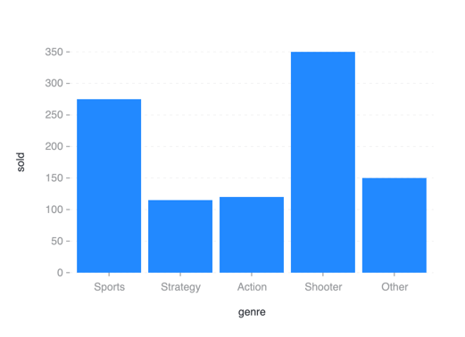

# pyG2

Python3 binding for `@AntV/G2` Plotting Library .

## Install

1. 从pypi安装

    ```shell
    pip install -U pip
    pip install g2
    ```

2. 从源码安装

    ```shell
    pip install -U pip
    pip install git+https://github.com/Jasonsey/pyG2.git
    ```

## Quick Start


```python
from g2 import Chart


def example_interval():
    chart = Chart(container='container', width=640, height=480)
    chart.interval().data([
        {'genre': 'Sports', 'sold': 275},
        {'genre': 'Strategy', 'sold': 115},
        {'genre': 'Action', 'sold': 120},
        {'genre': 'Shooter', 'sold': 350},
        {'genre': 'Other', 'sold': 150},
    ]).encode('x', 'genre').encode('y', 'sold').encode('color', 'genre')
    chart.render()

    
example_interval()
```



更多例子可以通过g2_examples这个模块进行查看, 例如上面的例子可以通过下面的代码访问

```python
from g2_examples.api import example_interval


example_interval()
```

## Reference

1. [@AntV/G2官方文档](https://g2.antv.antgroup.com/)
2. [@AntV/G2官方代码仓库](https://github.com/antvis/g2)
3. [PyG2Plot官方仓库](https://github.com/hustcc/PyG2Plot)

## Attention

1. 暂时不支持自定义js函数，因此参数中包含lambda函数的参数都暂时无法使用, 例如各种callback
2. 参数里面如果传输component也暂时不支持，例如custom palette中的type. 主要影响各种custom组件
3. 暂时不支持子图的创建，预计会在未来必要时维护该功能

## TODO

- [x] dataclass自动转换
- [x] kwargs自动处理
- [x] xxx_ 参数名自动转 xxx
- [x] Tuple类型转转json时自动转List
- [x] G2模块依赖关系分析
- [x] 整理需要对外暴露的接口
- [x] 维护例子代码文档
